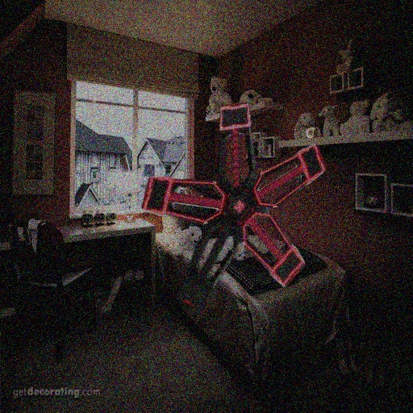
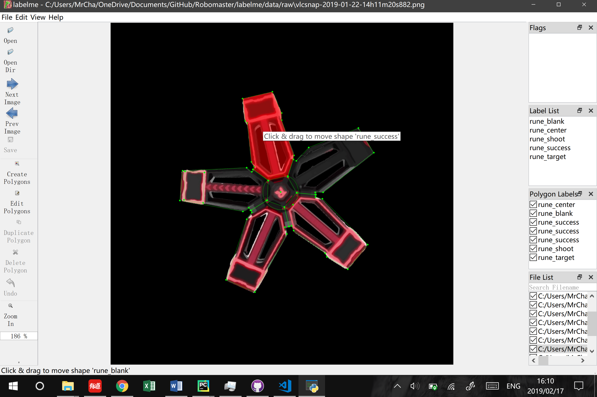
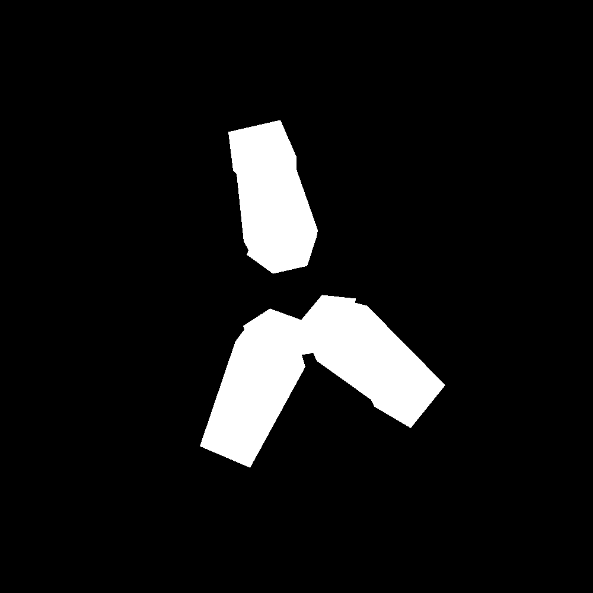
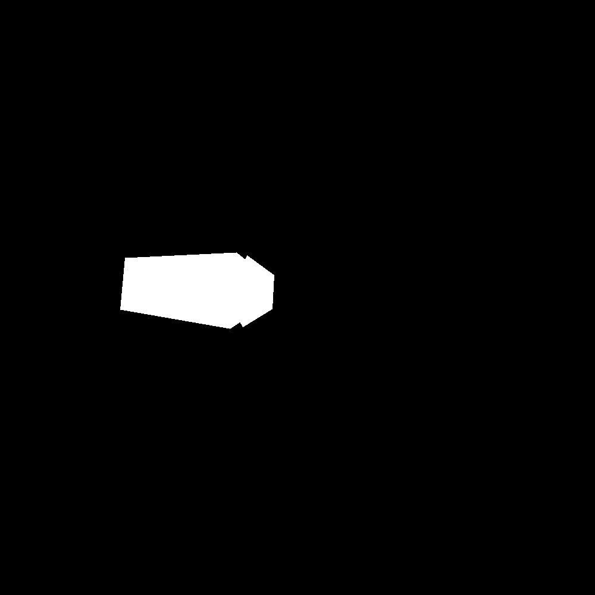
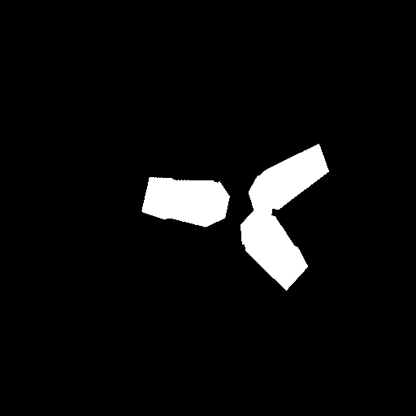

# Labelme to Data-Augmentation to Mask-RCNN or YOLOV3 Pipeline

## Introduction

In this repository, we present a pipeline that augments datasets of very limited samples (eg. 1 sample per class) to a larger dataset (eg. 5000 samples per class) that Mask R-CNN or YOLOv3 can directly read.  
  
Original image:  
  
Augumented image:  
  

The pipeline will first create binary mask png for each class in each image. Then it will perform same augmentation tranformation on each image and all corresponding mask files. The augmented image will be pasted onto random background. Lastly, it will feed those masks to Mask R-CNN in the form of ndarray of (height, width, num_classes) or YOLOv3 in forms of txt annotation.
  
## Important Note

1. This method should only be applied on very simple objects. You cannot expect dataset with 1 sample per class to work on complex environment.
2. IMPORTANT! This method should NOT be applied on dataset with large number of classes because it will create a png file for each class, even if the class does NOT appear in the image. Thus, for example, if you have 100 image and 100 classes, you will end up having 10000 png masks and probably 5000000 augmented png masks!
3. The sample image of objects should have black or transparent background.

## Pipeline

We will go through the whole pipeline with a very small dataset of 7 images and 5 classes.

### Generate Label
Use [Labelme](https://github.com/wkentaro/labelme/) libarary to generate annotated json file for each sample image. Please use only polygon or circle to create the mask.  
  

### Create PNG mask

Use `labelme2png.py` to create png binary mask for each class. It only suports polygon and circle for now. The script takes the json file from last step as input.  
  ...  
Suppose we set `in_dir = "image"` and `out_dir = "mask"` in the script. Then the folder will look like:

```
image/<image1>.png
image/<image1>.json
...
mask/<label1>/<image1>_<label1>.png
mask/<label2>/<image1>_<label2>.png
...
```

### Data Augmentation

Use `data_augmentation.py` to augment the sample images with their masks. It will take sample images, corresponding masks, and a different dataset of background images as input.  
  
IMPORTANT: This scripts use nature sort to align image and corresponding masks; missing mask or incorrect name will lead to wrong augmentation!  

The script runs in following steps:  

1. Load image and masks.
2. Load background images. Note that I've only tested augmentation where background and image are of same size (w, h). Difference in size may lead to bugs in alpha blending.
3. Define [augmentor](https://augmentor.readthedocs.io/en/master/). The current one includes rotation, shear, perspective transformation, saturation, brightness, random removal, flip, zoom, and distortion.
4. Sample a batch with augmentor.
5. Choose a random background and lower its brightness (since my model will be used in low-light condition).
6. Paste augmentated sample image to background with alpha blending. If the sample image has alpha layer, use alpha layer; otherwise, filter out the black background.
7. Check whether the image overflows.
8. Apply tons of gaussian noise. (You may adjust it to fit your need)
9. Save the image.
10. Goes back to 4.
  
The augmented files will be put in one folder. Augumented image will have names in form of `0_<image_num>.jpg`. Corresponding masks will have names in form of `<class_num>_<image_num>.png`.  
      
Example:
```
augmentation/0_0.jpg  # 0th augmented image
augmentation/0_1.jpg  # 1th augmented image
...
augmentation/1_0.png  # mask of 0th class of 0th image
augmentation/1_1.png  # mask of 0th class of 1th image
...
augmentation/2_0.png  # mask of 1th class of 0th image
augmentation/2_1.png  # mask of 1th class of 1th image
...
```

Augmented image:  
  
One of corresponding masks:  

  
P.S. The current script is relatively slow. It's mainly due to the massive transformation applied in augmentor, but the implementation of blending and brightness adjustment is not fast as well.

### Post Processing

Due to some limitation in the scripts we use in last step. While the image is resized to the size we set, the size of masks is unchanged. Furthermore, due to the brightness change, some mask files are no longer binary -- some of them turn grey. Hence, we have a short script `postprocess.py` to resize and binarize all masks.  
P.S. Actually this script can be combined to last one but I'm just too lazy...

### Split Train/Val Set

Run script `train_val_split.py`, 20% original data will be moved to a new folder `val/`. Manually move the rest of data to a folder `train/`.

### Feed Image to Mask R-CNN

Now all we need to do is to train Mask R-CNN with our new dataset. We provide a sample python file `rune.py` to show how to import image and masks to Mask R-CNN. To use the example, simply clone [Mask R-CNN](https://github.com/matterport/Mask_RCNN) and move the example file to the same folder of `setup.py`. Basically, what we did is to set labels, import images, and, for each image load all masks of it as a ndarray of (height, width, num_class).  
  
Usage:

```
python3 rune.py train --dataset <path_to_data> --weights <pretrain_weights>
python3 rune.py detect --weights <weights> --image <path_to_image>
python3 rune.py detect --weights <weights> --image <path_to_video>
```

P.S. I change the code for visualizing image/video result. Refer to original script in the repository above for more infomation.

### Switch to YOLOv3 format

It relatively easy to switch to [YOLOv3](https://github.com/AlexeyAB/darknet) format. With a simple script `png2yolo.py`, we can find the boundry of each mask, and write it in YOLOv3 format:  

```
<class_number> <x_center> <y_center> <width> <height>
```  
Note that you need to run the script on both `train/` and `val/`. After this you can create `train.txt` and `val.txt` with script `list.py`.
    
Please refer to the link above for more information. Edit cfg and data file accordingly and then you can begin training.
